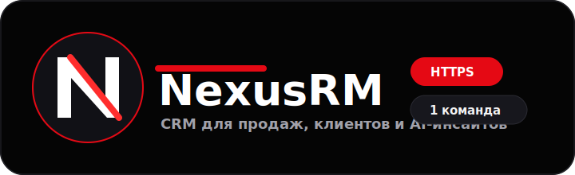
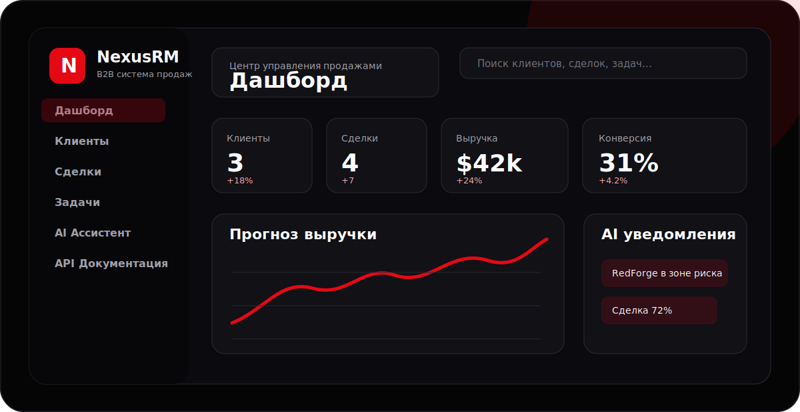
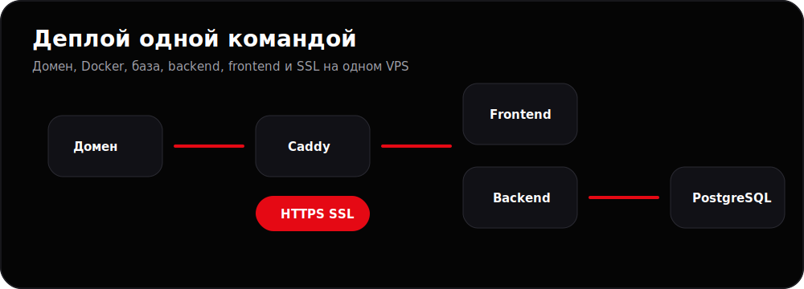
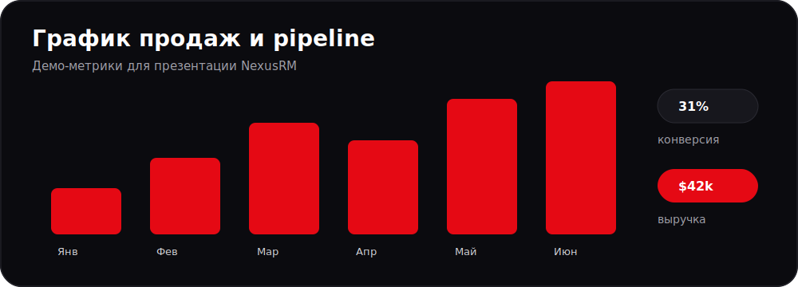

<p align="center">
  
</p>

<p align="center">
  <b>Профессиональная CRM-система для B2B IT, digital-агентств, консалтинга и outsourcing-команд.</b>
</p>

<p align="center">
  
  
  
  
  
  
</p>



## Что такое NexusRM

NexusRM - hackathon-ready CRM с темным SaaS-интерфейсом, backend API, PostgreSQL, ролями, демо-данными, AI-инсайтами, публичным API и автоматическим production-деплоем на VPS.

Проект можно показать как готовый продукт: есть дашборд, клиенты, сделки, задачи, AI Ассистент, API Документация, админ-панель и установка на сервер одной командой.

## Установка на сервер одной командой

Перед запуском:

- VPS на Ubuntu/Debian с root или sudo-доступом.
- DNS A-запись домена указывает на IP сервера.
- Порты `80` и `443` открыты.

```bash
curl -fsSL https://raw.githubusercontent.com/Mr-X-01/NexusRM/main/install-server.sh | sudo bash -s -- crm.example.com
```

Замените `crm.example.com` на свой домен.

Вариант с email для SSL-уведомлений:

```bash
curl -fsSL https://raw.githubusercontent.com/Mr-X-01/NexusRM/main/install-server.sh | sudo bash -s -- crm.example.com admin@example.com
```

После установки:

- CRM: `https://crm.example.com`
- Swagger API: `https://crm.example.com/api/docs`

Демо-вход:

| Роль | Email | Пароль |
| --- | --- | --- |
| Админ | `admin@nexusrm.ai` | `admin123` |
| Менеджер | `manager@nexusrm.ai` | `manager123` |

Демо-ключ публичного API:

```text
nxrm_demo_public_key
```

## Как работает деплой



`install-server.sh` автоматически:

- устанавливает системные пакеты;
- устанавливает Docker Engine и Docker Compose plugin, если их нет;
- клонирует `https://github.com/Mr-X-01/NexusRM` в `/opt/nexusrm`;
- создает production `.env` с доменом, CORS, JWT-секретами и паролем PostgreSQL;
- собирает backend и frontend Docker-образы;
- запускает PostgreSQL;
- применяет Prisma migrations;
- добавляет демо-пользователей и демо-CRM данные, если база пустая;
- запускает backend, frontend и Caddy;
- выпускает HTTPS-сертификат Let's Encrypt через Caddy;
- открывает `80/443` в `ufw`, если firewall установлен.

Повторный запуск той же команды работает как обновление. Секреты и пароль базы сохраняются, а seed запускается только если в базе еще нет пользователей.

## График демо-метрик



| Метрика | Значение | Что показывает |
| --- | ---: | --- |
| Клиенты | `3` | демо-база активных B2B клиентов |
| Pipeline | `$122,500` | сумма открытых и выигранных сделок |
| Прогноз месяца | `$42,000` | AI-прогноз выручки |
| Конверсия | `31%` | состояние sales funnel |
| Риск | `RedForge` | клиент без активности 14 дней |

## Возможности

Полный список есть в [FEATURES.md](FEATURES.md).

Кратко:

- клиенты, контакты, сделки, задачи, активности и заметки;
- роли `admin`, `manager`, `viewer`;
- JWT access/refresh авторизация;
- Kanban pipeline сделок;
- AI sales mock: оценка сделок, health score, прогноз и поиск рисков;
- публичный API для интеграций с ключом `x-api-key`;
- Swagger/OpenAPI документация;
- адаптивный premium dark UI для демо и презентации.

## Локальный запуск

Через Docker:

```bash
cp .env.example .env
docker compose up --build
```

Или одной локальной командой:

```bash
sh install.sh
```

Локальные адреса:

- Frontend: `http://localhost:3000`
- Backend: `http://localhost:4000`
- Swagger: `http://localhost:4000/api/docs`

## Управление на сервере

```bash
cd /opt/nexusrm
docker compose -f docker-compose.prod.yml --env-file .env ps
docker compose -f docker-compose.prod.yml --env-file .env logs -f
docker compose -f docker-compose.prod.yml --env-file .env restart
docker compose -f docker-compose.prod.yml --env-file .env down
```

Логи Caddy и SSL:

```bash
cd /opt/nexusrm
docker compose -f docker-compose.prod.yml --env-file .env logs -f caddy
```

Если SSL не появился сразу:

```bash
dig crm.example.com
curl -I http://crm.example.com
```

## Стек

| Слой | Технологии |
| --- | --- |
| Backend | Node.js, NestJS, Prisma, PostgreSQL, Swagger, JWT, bcrypt |
| Frontend | React, TypeScript, Vite, Tailwind CSS, Recharts, lucide-react |
| Безопасность | Helmet, CORS, ValidationPipe, RBAC, API keys, audit logs |
| Deploy | Docker, Docker Compose, Caddy, Let's Encrypt, bash installer |

## Структура проекта

```text
nexusrm/
  backend/                 NestJS REST API, Prisma schema, seed data
  frontend/                React + Vite SaaS interface
  frontend/public/logo.svg Логотип приложения и favicon
  deploy/Caddyfile         HTTPS reverse proxy для production
  docs/                    Архитектура, API, безопасность, демо-сценарий
  docs/assets/             Логотип и изображения README
  mobile/                  Roadmap будущего Expo-приложения
  docker-compose.yml       Локальный Docker Compose
  docker-compose.prod.yml  Production Docker Compose
  install.sh               Локальный Docker installer
  install-server.sh        Серверная установка одной командой
  .env.example             Пример переменных окружения
```

## Безопасность

Секреты не хранятся в репозитории. Серверный инсталлятор генерирует новые JWT-секреты и пароль PostgreSQL при первом запуске. Production `.env` остается только на сервере в `/opt/nexusrm/.env`.

Пароли пользователей хешируются через bcrypt. Приватные маршруты закрыты JWT guard, роли проверяются через RBAC guard, публичные integration routes требуют `x-api-key`, а важные действия попадают в audit logs.
