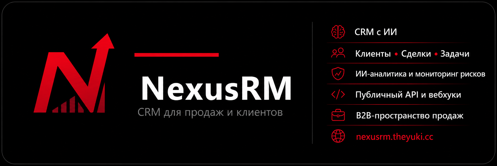
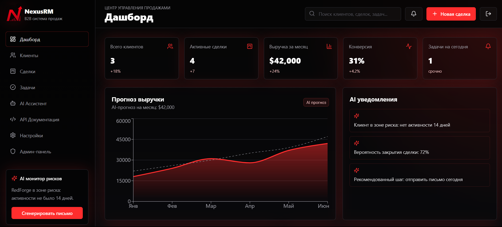
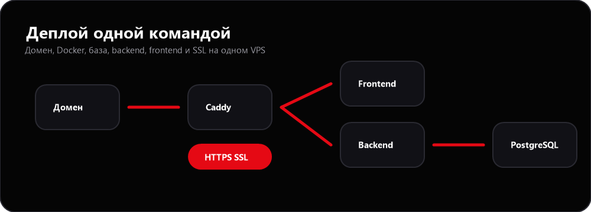
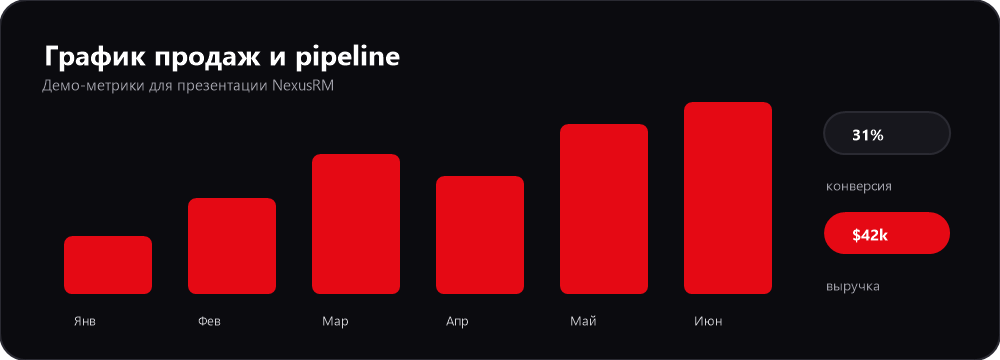

<p align="center">
  
</p>

<p align="center">
  <b>Профессиональная CRM-система для B2B IT, digital-агентств, консалтинга и outsourcing-команд.</b>
</p>

<p align="center">
  <b>Node.js 22</b> · <b>NestJS 11</b> · <b>React 18</b> · <b>PostgreSQL 16</b> · <b>Docker Compose</b> · <b>Caddy HTTPS</b>
</p>



## Что такое NexusRM

NexusRM — это production-ready CRM-платформа для B2B-команд: единая база клиентов, сделок и задач, sales-аналитика, AI-ассистент и публичный API для интеграций. Система построена на типобезопасном стеке (NestJS + Prisma + React) и поставляется с автоматическим деплоем на VPS под HTTPS одной командой.

В отличие от набора разрозненных скриптов, NexusRM — это цельный продукт: backend с ролевой моделью и audit logs, frontend с дашбордом, Kanban-воронкой, профилями клиентов и AI Deal Rescue, а также документированный REST API со Swagger. Всё, от схемы базы до reverse proxy, описано в коде и инфраструктуре репозитория.

### Кому подходит

- B2B IT-компаниям, digital-агентствам, консалтингу и outsourcing-командам;
- командам, которым нужна self-hosted CRM с полным контролем над данными;
- разработчикам, которым важен открытый REST API и возможность дорабатывать продукт под себя.

### Документация

| Документ | Содержание |
| --- | --- |
| [docs/architecture.md](docs/architecture.md) | Архитектура, разделение backend по доменам, поток данных |
| [docs/api.md](docs/api.md) | REST API: авторизация, админ-маршруты, AI-чат, публичный API |
| [docs/security.md](docs/security.md) | Модель безопасности и памятка для production |
| [FEATURES.md](FEATURES.md) | Полный список возможностей продукта |

## Установка на сервер одной командой

Перед запуском:

- VPS на Ubuntu/Debian с root или sudo-доступом.
- DNS A-запись домена указывает на IP сервера.
- Порты `80` и `443` открыты.

```bash
curl -fsSL https://raw.githubusercontent.com/Mr-X-01/NexusRM/main/install-server.sh | sudo bash -s -- crm.example.com
```

Замените `crm.example.com` на свой домен.

Вариант с email для SSL-уведомлений:

```bash
curl -fsSL https://raw.githubusercontent.com/Mr-X-01/NexusRM/main/install-server.sh | sudo bash -s -- crm.example.com admin@example.com
```

После установки:

- CRM: `https://crm.example.com`
- Swagger API: `https://crm.example.com/api/docs`

Демо-вход:

| Роль | Email | Пароль |
| --- | --- | --- |
| Админ: Алексей Орлов | `admin@nexusrm.ai` | `admin123` |
| Менеджер: Мария Чен | `manager@nexusrm.ai` | `manager123` |
| Просмотр: Илья Соколов | `viewer@nexusrm.ai` | `viewer123` |

Аккаунты отличаются не только подписью: роли проходят через backend JWT/RBAC, админ видит расширенную админ-панель, менеджер работает с CRM, а viewer не получает доступ к административным endpoints.

Демо-ключ публичного API:

```text
nxrm_demo_public_key
```

Если нужен живой AI-чат через DeepSeek, передайте ключ как переменную окружения при повторном запуске установщика:

```bash
curl -fsSL https://raw.githubusercontent.com/Mr-X-01/NexusRM/main/install-server.sh | sudo env DEEPSEEK_API_KEY="ваш_ключ" bash -s -- crm.example.com admin@example.com
```

Ключ будет сохранен только в `/opt/nexusrm/.env` на сервере и не попадет в репозиторий.

## Как работает деплой



`install-server.sh` автоматически:

- устанавливает системные пакеты;
- устанавливает Docker Engine и Docker Compose plugin, если их нет;
- клонирует `https://github.com/Mr-X-01/NexusRM` в `/opt/nexusrm`;
- создает production `.env` с доменом, CORS, JWT-секретами и паролем PostgreSQL;
- собирает backend и frontend Docker-образы;
- запускает PostgreSQL;
- применяет Prisma migrations;
- добавляет демо-пользователей и демо-CRM данные, если база пустая;
- запускает backend, frontend и Caddy;
- выпускает HTTPS-сертификат Let's Encrypt через Caddy;
- проверяет, что backend и Swagger `/api/docs` реально отвечают;
- открывает `80/443` в `ufw`, если firewall установлен.

Повторный запуск той же команды работает как обновление. Секреты и пароль базы сохраняются. Если CRM-данные уже есть, установщик не перезаписывает клиентов, сделки и задачи, но безопасно обновляет системные аккаунты, роли, настройки workspace и demo API key.

## Возможности

Полный список есть в [FEATURES.md](FEATURES.md).

Кратко:

- клиенты, контакты, сделки, задачи, активности и заметки;
- роли `admin`, `manager`, `viewer`;
- JWT access/refresh авторизация;
- реальные профили пользователей: должность, отдел, статус, последний вход;
- расширенная админ-панель: пользователи, системные настройки, API-ключи, audit logs и сводка объектов;
- Kanban pipeline сделок;
- AI sales-аналитика: оценка сделок, health score, прогноз выручки и поиск рисков;
- AI Deal Rescue: разбор причины риска по сделке, рекомендованные шаги, генерация follow-up письма и создание задачи в один клик;
- AI чат через DeepSeek с детерминированным локальным fallback, если `DEEPSEEK_API_KEY` не задан;
- публичный API для интеграций с ключом `x-api-key`;
- Swagger/OpenAPI документация;
- встроенная API-документация в интерфейсе, если Swagger временно недоступен;
- адаптивный premium dark UI с поддержкой мобильных устройств.

## Локальный запуск

Через Docker:

```bash
cp .env.example .env
docker compose up --build
```

Или одной локальной командой:

```bash
sh install.sh
```

Локальные адреса:

- Frontend: `http://localhost:3000`
- Backend: `http://localhost:4000`
- Swagger: `http://localhost:4000/api/docs`

## Управление на сервере

```bash
cd /opt/nexusrm
docker compose -f docker-compose.prod.yml --env-file .env ps
docker compose -f docker-compose.prod.yml --env-file .env logs -f
docker compose -f docker-compose.prod.yml --env-file .env restart
docker compose -f docker-compose.prod.yml --env-file .env down
```

Логи Caddy и SSL:

```bash
cd /opt/nexusrm
docker compose -f docker-compose.prod.yml --env-file .env logs -f caddy
```

Если SSL не появился сразу:

```bash
dig crm.example.com
curl -I http://crm.example.com
```

## Стек и обоснование выбора

Подробное описание архитектуры — в [docs/architecture.md](docs/architecture.md).

| Слой | Технологии | Почему именно так |
| --- | --- | --- |
| Backend | Node.js 22, NestJS 11, Prisma, PostgreSQL 16, Swagger, JWT, bcrypt | NestJS даёт модульную структуру и DI, что упрощает разделение по доменам (auth, clients, deals, tasks, ai, admin). Prisma — типобезопасный доступ к данным и миграции из коробки. PostgreSQL выбран за надёжность, реляционную целостность и поддержку JSON для гибких полей. |
| Frontend | React 18, TypeScript, Vite, Tailwind CSS, Recharts, lucide-react | Vite даёт быструю сборку и HMR. Tailwind — консистентный дизайн без отдельного CSS-слоя. Recharts строит графики pipeline и выручки. TypeScript держит контракт с API в одном типовом пространстве. |
| Безопасность | Helmet, CORS, ValidationPipe, RBAC, API keys, audit logs, rate limiting | Многослойная защита: заголовки, валидация DTO в whitelist-режиме, ролевые guard'ы и журналирование чувствительных действий. Детали — в [docs/security.md](docs/security.md). |
| AI | DeepSeek API с детерминированным локальным fallback | Живой AI-чат и генерация follow-up работают через внешний LLM при наличии `DEEPSEEK_API_KEY`, но при его отсутствии система не ломается — отвечает локальный CRM-движок на основе реальных данных. |
| Deploy | Docker, Docker Compose, Caddy, Let's Encrypt, bash installer | Контейнеризация делает окружение воспроизводимым. Caddy автоматически выпускает и продлевает HTTPS-сертификаты. Один bash-скрипт разворачивает весь стек на чистом VPS. |

### Как устроен backend

Backend разделён по продуктовым доменам, каждый со своим контроллером и DTO-валидацией:

- `auth` — регистрация, JWT access/refresh, текущий пользователь;
- `clients` / `deals` / `tasks` — CRM-ядро с RBAC и audit logs;
- `ai` — инсайты, scoring сделок, AI Deal Rescue и чат с LLM;
- `public` — integration endpoints за `x-api-key`;
- `admin` — пользователи, настройки workspace, API-ключи, audit logs.

Полный поток данных (login → Bearer JWT → RBAC → мутация → audit log) описан в [docs/architecture.md](docs/architecture.md), а контракты маршрутов — в [docs/api.md](docs/api.md).

## Демо-данные и метрики

После первого деплоя база заполняется демонстрационным набором, чтобы продукт можно было оценить сразу. Установщик не перезаписывает реальные данные при повторных запусках.



| Метрика | Значение | Что показывает |
| --- | ---: | --- |
| Клиенты | `3` | стартовая база активных B2B-клиентов |
| Pipeline | `$122,500` | сумма открытых и выигранных сделок |
| Прогноз месяца | `$42,000` | AI-прогноз выручки |
| Конверсия | `31%` | состояние sales funnel |
| Риск | `RedForge` | клиент без активности 14 дней |

## Структура проекта

```text
nexusrm/
  backend/                 NestJS REST API, Prisma schema, seed data
  frontend/                React + Vite SaaS interface
  frontend/public/logo.png Логотип приложения и favicon
  deploy/Caddyfile         HTTPS reverse proxy для production
  docs/                    Архитектура, API, безопасность, демо-сценарий
  docs/assets/             Логотип и изображения README
  mobile/                  Roadmap будущего Expo-приложения
  docker-compose.yml       Локальный Docker Compose
  docker-compose.prod.yml  Production Docker Compose
  install.sh               Локальный Docker installer
  install-server.sh        Серверная установка одной командой
  .env.example             Пример переменных окружения
```

## Безопасность

Секреты не хранятся в репозитории. Серверный инсталлятор генерирует новые JWT-секреты и пароль PostgreSQL при первом запуске. Production `.env` остается только на сервере в `/opt/nexusrm/.env`.

Пароли пользователей хешируются через bcrypt. Приватные маршруты закрыты JWT guard, роли проверяются через RBAC guard, публичные integration routes требуют `x-api-key`, а важные действия попадают в audit logs.
